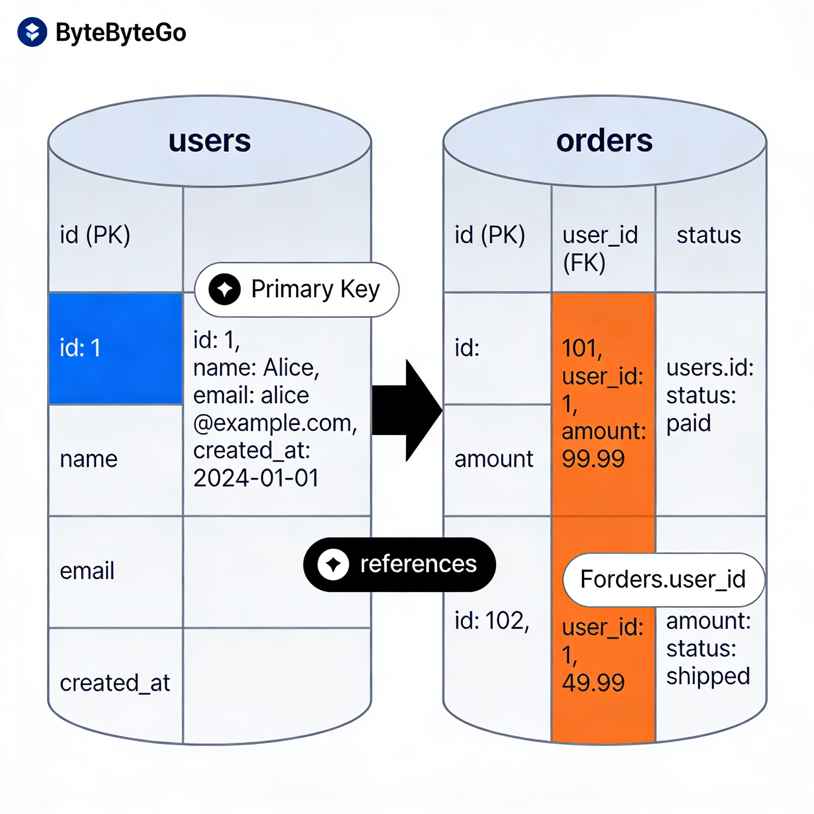

# PostgreSQL Fundamentals

## 1. Overview

PostgreSQL is a relational database — a system that stores data in structured tables with rows and columns, and enforces relationships between them.

Think of it as a highly organized filing cabinet: every drawer (table) has labeled slots (columns), every piece of paper (row) fits the same format, and there are strict rules about what goes where.

Unlike a simple spreadsheet, PostgreSQL enforces rules, handles millions of rows efficiently, supports concurrent users, and guarantees your data stays consistent even when things go wrong.

---

## 2. Why This Matters

**Where it is used:**
- Every serious backend application stores persistent data somewhere. PostgreSQL is one of the most common choices.
- Used in production at companies like Instagram, Reddit, Shopify, and Notion.

**Problems it solves:**
- Raw files or in-memory storage can't handle scale, concurrency, or crash recovery.
- Relational databases give you a structured, queryable, durable store for your data.

**Why engineers must understand this:**
- You cannot design a good API without understanding your data layer.
- Bad schema design creates problems that are extremely hard to undo at scale.
- Performance, correctness, and reliability of your backend all depend on how well you use the database.

---

## 3. Core Concepts (Deep Dive)

### 3.1 Tables and Schema

**Explanation:**
A table is a grid of rows and columns. A schema is the blueprint — the definition of what columns exist, what types they hold, and what rules apply.

**Intuition:**
Imagine a spreadsheet where column types are enforced. A `birthdate` column will only accept dates — no text, no nulls unless you explicitly allow them.

**When it is used:**
Every time you model a domain — users, orders, products — you create tables with a defined schema.

---

### 3.2 Data Types

**Explanation:**
Every column has a type: `TEXT`, `INTEGER`, `BOOLEAN`, `TIMESTAMP`, `UUID`, `JSONB`, etc. PostgreSQL enforces these strictly.

**Intuition:**
Types are contracts. If a column is `INTEGER`, it will never accidentally store `"hello"`. This prevents bugs at the data layer before they reach your application.

**When it is used:**
During schema design. Choosing the right type matters — `TIMESTAMP WITH TIME ZONE` vs `TIMESTAMP WITHOUT TIME ZONE` can cause real bugs in distributed systems.

---

### 3.3 Primary Keys

**Explanation:**
A primary key is a column (or set of columns) that uniquely identifies every row. No two rows can share the same primary key value. It cannot be null.

**Intuition:**
Think of it as a national ID number. Every citizen has a unique one. You can always find exactly one person using it.

**Common choices:**
- `SERIAL` / `BIGSERIAL` — auto-incrementing integers
- `UUID` — universally unique identifiers (better for distributed systems)

**When it is used:**
Every table should have a primary key. This is not optional in well-designed systems.

---

### 3.4 Foreign Keys

**Explanation:**
A foreign key is a column in one table that references the primary key of another table. It enforces a relationship — you cannot reference a row that doesn't exist.

**Intuition:**
An `orders` table has a `user_id` column. That `user_id` must point to a real user in the `users` table. PostgreSQL will reject an insert if you try to create an order for a non-existent user.

**When it is used:**
Whenever two entities are related — users and orders, posts and comments, products and categories.

```sql
CREATE TABLE orders (
  id SERIAL PRIMARY KEY,
  user_id INTEGER REFERENCES users(id),
  total NUMERIC(10, 2)
);
```

---

### 3.5 Basic CRUD Operations

**Explanation:**
CRUD = Create, Read, Update, Delete. These are the four fundamental operations on any data store.

| Operation | SQL Command |
|-----------|-------------|
| Create    | `INSERT`    |
| Read      | `SELECT`    |
| Update    | `UPDATE`    |
| Delete    | `DELETE`    |

**Intuition:**
Every feature you build ultimately reduces to some combination of these four operations.

---

### 3.6 Data Modeling Basics

**Explanation:**
Data modeling is the process of deciding how to organize your data into tables and relationships before writing any code.

**Key principle — Normalization:**
Avoid storing the same data in multiple places. If a user's name changes, you want to update it in one place, not fifty.

**The rule of thumb:**
- Each table should represent one thing (one entity or one relationship)
- Columns should describe that thing, not other things

**Intuition:**
Don't store `user_email` in the `orders` table. The order table should only know the `user_id`. To get the email, join to the `users` table. This way, if the email changes, you don't have stale data spread everywhere.

---

## 4. Simple Example

```sql
-- Create tables
CREATE TABLE users (
  id SERIAL PRIMARY KEY,
  name TEXT NOT NULL,
  email TEXT UNIQUE NOT NULL,
  created_at TIMESTAMP DEFAULT NOW()
);

CREATE TABLE orders (
  id SERIAL PRIMARY KEY,
  user_id INTEGER REFERENCES users(id) ON DELETE CASCADE,
  amount NUMERIC(10, 2) NOT NULL,
  status TEXT DEFAULT 'pending'
);

-- Insert
INSERT INTO users (name, email) VALUES ('Alice', 'alice@example.com');

-- Read
SELECT * FROM users WHERE email = 'alice@example.com';

-- Update
UPDATE orders SET status = 'shipped' WHERE id = 1;

-- Delete
DELETE FROM users WHERE id = 1;
```

Key detail: `ON DELETE CASCADE` means if a user is deleted, all their orders are automatically deleted too. This is a conscious design decision — not a default.

---

## 5. System Perspective

**In production systems:**
- Tables can have hundreds of millions of rows.
- Schema changes (adding columns, renaming tables) become dangerous and require careful migration strategies.
- Foreign keys add write overhead — every insert/update must verify the referenced row exists.

**Under high traffic:**
- Concurrent writes to the same table can cause lock contention.
- Poorly chosen primary key types (e.g., sequential integers) can cause insert hotspots.
- `UUID` primary keys distribute inserts more evenly but are larger and slightly slower to index.

**Under failure:**
- PostgreSQL uses WAL (Write-Ahead Logging) — changes are written to a log before being applied. If the server crashes, it replays the log to recover.
- Foreign key constraints protect against orphaned data even if application code has bugs.

---

## 6. Diagram Section



**What the diagram should show:**
- Two tables: `users` and `orders`
- Columns listed in each table with their types
- An arrow from `orders.user_id` → `users.id` showing the foreign key relationship
- A row in `users` and two rows in `orders` pointing to that user
- Label: "Primary Key" on `users.id`, "Foreign Key" on `orders.user_id`

---

## 7. Common Mistakes

**1. No primary key on a table**
Every table needs a unique identifier. Without it, you cannot reliably reference, update, or delete specific rows.

**2. Storing redundant data across tables**
Copying `user_email` into `orders` seems convenient but creates consistency problems. Use foreign keys and joins instead.

**3. Using `TEXT` for everything**
Choosing the wrong type means PostgreSQL can't optimize storage or enforce correctness. Use `INTEGER` for counts, `BOOLEAN` for flags, `TIMESTAMP` for times.

**4. Not using `NOT NULL` constraints**
Allowing nulls everywhere leads to null-check hell in application code. Be explicit about what can and cannot be null.

**5. Designing schema after writing the application**
Schema design must come first. Retrofitting a bad schema into a running system is one of the most painful experiences in engineering.

**6. Deleting without understanding cascade behavior**
Not thinking through `ON DELETE` behavior leads to either orphaned records or unintended mass deletions.

---

## 8. Interview / Thinking Questions

1. What is the difference between a primary key and a unique constraint? Can a table have both?

2. You have a `posts` table and a `users` table. A post is written by a user. Where does the foreign key live, and why?

3. What happens if you try to insert an order with a `user_id` that doesn't exist in the `users` table? What does PostgreSQL do?

4. Why might you choose `UUID` over `SERIAL` for a primary key in a distributed system?

5. What is the cost of foreign key constraints at high write volumes, and how would you reason about whether to keep them?

---

## 9. Build It Yourself

**Task: Design and populate a mini e-commerce schema**

1. Create a `users` table with `id`, `name`, `email`, `created_at`
2. Create a `products` table with `id`, `name`, `price`, `stock`
3. Create an `orders` table with `id`, `user_id`, `created_at`, `status`
4. Create an `order_items` table linking orders to products with a `quantity` column
5. Insert 2 users, 3 products, 1 order with 2 items
6. Write a query to get all orders for a specific user with product names and quantities

This forces you to think about relationships, foreign keys, and join design before touching any application code.

---

## 10. Use AI vs Think Yourself

### Use AI For:
- Generating boilerplate `CREATE TABLE` SQL
- Remembering exact syntax for constraints and types
- Writing repetitive INSERT statements for test data
- Explaining PostgreSQL error messages

### Must Understand Yourself:
- How to design a schema for a new domain — what tables, what relationships, what constraints
- Why normalization matters and when to intentionally denormalize
- What `ON DELETE CASCADE` vs `ON DELETE RESTRICT` means for your system's behavior
- Whether a column should be nullable or not (this is a domain decision, not a syntax question)

---

## 11. Key Takeaways

- A table is not just a spreadsheet — it is a contract. Types, constraints, and keys enforce correctness at the data layer.
- Primary keys uniquely identify rows. Foreign keys enforce relationships between tables. Both are non-negotiable in good design.
- Schema design is architecture. A bad schema is technical debt that compounds over time.
- CRUD is the foundation — every feature is some combination of insert, select, update, and delete.
- Think before you type. Design the schema on paper before writing any SQL.
