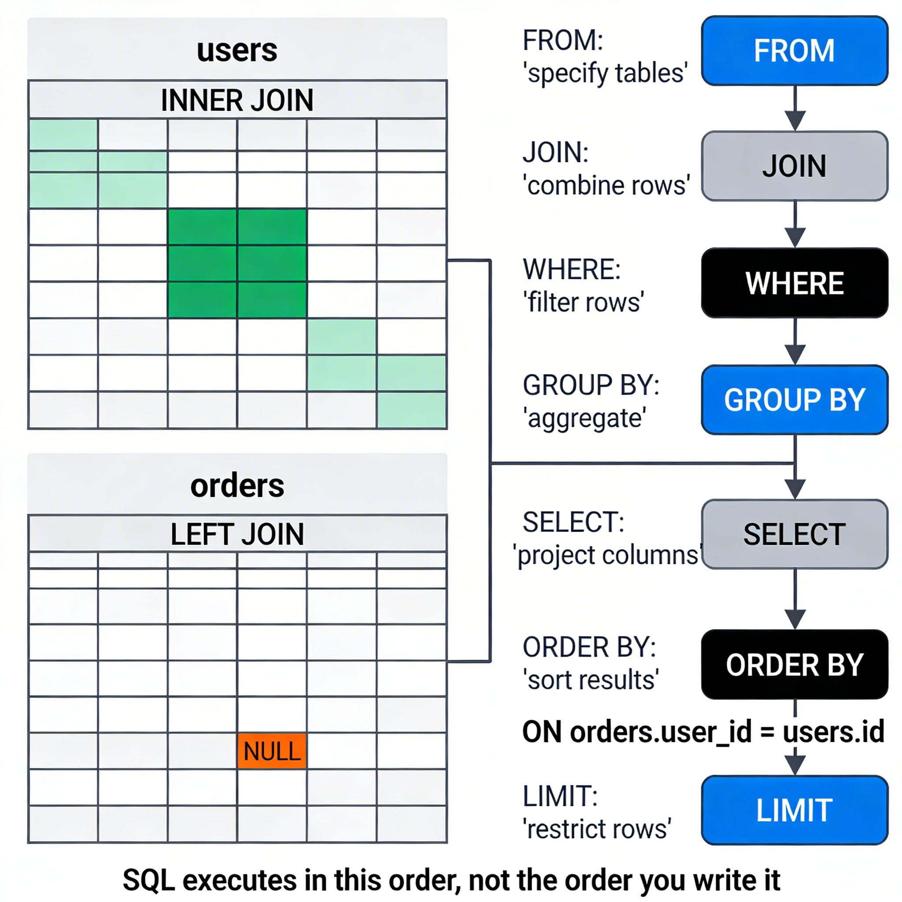

# SQL Deep Dive

## 1. Overview

SQL (Structured Query Language) is the language you use to talk to a relational database. You write a query describing *what* data you want — the database figures out *how* to fetch it.

That distinction is critical: SQL is declarative. You don't write a loop to find rows. You describe the shape of the result, and the query engine builds an execution plan to retrieve it efficiently.

Understanding SQL deeply means understanding not just syntax, but *how the database thinks about your query* — which determines performance, correctness, and scale.

---

## 2. Why This Matters

**Where it is used:**
- Every backend that touches a relational database uses SQL.
- Reporting, analytics, data migrations, admin tools — all SQL.

**Problems it solves:**
- Without SQL, you would need to scan files manually, write your own filtering and sorting logic, and manage your own joins in application code.
- SQL lets the database engine do what it is optimized for: finding, filtering, and combining data at scale.

**Why engineers must understand this:**
- Poorly written queries are one of the top causes of slow APIs.
- ORM-generated queries often hide what SQL is actually running — engineers who don't understand SQL can't debug or optimize them.
- JOIN logic, aggregation, and filtering are real design skills. Getting them wrong produces incorrect results, not just slow ones.

---

## 3. Core Concepts (Deep Dive)

### 3.1 SELECT and Projections

**Explanation:**
`SELECT` retrieves rows from a table. You specify which columns you want (projection) and which rows to include (filtering).

**Intuition:**
Think of a table as a full spreadsheet. `SELECT` lets you show only specific columns (hiding others) and only specific rows (matching conditions). You're not changing the data — you're choosing what to look at.

**Bad habit:**
`SELECT *` fetches every column. In production, this wastes bandwidth, memory, and can expose sensitive fields. Always select only what you need.

---

### 3.2 WHERE Clause (Filtering)

**Explanation:**
`WHERE` filters which rows are returned. It evaluates a condition for each row and includes only rows where the condition is true.

**Key operators:** `=`, `!=`, `>`, `<`, `>=`, `<=`, `LIKE`, `IN`, `BETWEEN`, `IS NULL`, `AND`, `OR`, `NOT`

**Intuition:**
The database scans candidates row by row (unless an index is used) and checks your condition like a bouncer at a door — only matching rows get through.

**Performance note:**
Filtering on unindexed columns causes full table scans. The `WHERE` clause is where indexes matter most.

---

### 3.3 ORDER BY and LIMIT

**Explanation:**
`ORDER BY` sorts results by one or more columns. `LIMIT` caps how many rows are returned. Together, they power pagination.

**Intuition:**
`ORDER BY created_at DESC LIMIT 10` is how every "recent posts" or "latest orders" feature works.

**When it is used:**
Any feature showing lists, feeds, or paginated results.

**Watch out:**
Deep pagination (`LIMIT 10 OFFSET 100000`) is slow — the database still scans and discards the skipped rows. Cursor-based pagination is more efficient at scale.

---

### 3.4 JOINs

**Explanation:**
A JOIN combines rows from two or more tables based on a related column. It is how you query across relationships.

**Types:**

| Type | Behavior |
|------|----------|
| `INNER JOIN` | Only rows that match in both tables |
| `LEFT JOIN` | All rows from the left table, matched rows from the right (nulls if no match) |
| `RIGHT JOIN` | Opposite of LEFT JOIN (rarely used) |
| `FULL OUTER JOIN` | All rows from both tables |

**Intuition — INNER JOIN:**
You have a `users` table and an `orders` table. An INNER JOIN returns only users who have orders. Users without orders are excluded.

**Intuition — LEFT JOIN:**
Same setup, but LEFT JOIN returns all users. Those without orders get `NULL` in the order columns. Useful when you want "users and their orders, if any."

**When it is used:**
Anytime you query data that spans multiple tables. In a normalized schema, you will be joining constantly.

```sql
-- Get all orders with user names (INNER JOIN)
SELECT users.name, orders.amount, orders.status
FROM orders
INNER JOIN users ON orders.user_id = users.id;

-- Get all users, even those with no orders (LEFT JOIN)
SELECT users.name, COUNT(orders.id) AS order_count
FROM users
LEFT JOIN orders ON orders.user_id = users.id
GROUP BY users.id;
```

---

### 3.5 Aggregations

**Explanation:**
Aggregation functions collapse multiple rows into a single value. Common ones: `COUNT`, `SUM`, `AVG`, `MIN`, `MAX`.

**Intuition:**
Instead of "give me all orders," you ask "how many orders does each user have?" — that's an aggregation.

**GROUP BY:**
Groups rows by a column before aggregating. Every column in `SELECT` that isn't an aggregate must appear in `GROUP BY`.

**HAVING:**
Filters on the result of an aggregation. Like `WHERE`, but applied after grouping.

```sql
-- Total revenue per user
SELECT user_id, SUM(amount) AS total_spent
FROM orders
GROUP BY user_id
HAVING SUM(amount) > 500;
```

---

### 3.6 Query Execution Order

**Explanation:**
SQL does not execute in the order you write it. The actual logical processing order is:

```
FROM → JOIN → WHERE → GROUP BY → HAVING → SELECT → ORDER BY → LIMIT
```

**Why this matters:**
You cannot use a `SELECT` alias in a `WHERE` clause — because `WHERE` runs before `SELECT` assigns the alias. This trips up many beginners.

**Intuition:**
Think of it as a pipeline. Data flows through each stage. Each stage filters or transforms the output of the previous stage.

---

## 4. Simple Example

```sql
-- Scenario: Get the top 3 users by total order value, only for completed orders

SELECT
  users.name,
  SUM(orders.amount) AS total_spent
FROM users
INNER JOIN orders ON orders.user_id = users.id
WHERE orders.status = 'completed'
GROUP BY users.id, users.name
ORDER BY total_spent DESC
LIMIT 3;
```

Walk through the execution:
1. `FROM users` — start with the users table
2. `INNER JOIN orders` — combine with orders where user_id matches
3. `WHERE status = 'completed'` — filter to only completed orders
4. `GROUP BY users.id` — group combined rows per user
5. `SUM(orders.amount)` — calculate total per group
6. `ORDER BY total_spent DESC` — sort by total
7. `LIMIT 3` — take the top 3

---

## 5. System Perspective

**In production:**
- Queries run thousands of times per second. A query that takes 200ms instead of 2ms is a 100x degradation.
- ORMs (like Prisma, Sequelize, SQLAlchemy) generate SQL for you, but you must understand what SQL they're generating. Enable query logging in development.

**Under high traffic:**
- Complex JOINs across large tables can lock rows and block other queries.
- Aggregations on millions of rows without indexes cause full scans — this destroys response time.
- Pagination using `OFFSET` degrades linearly as offset grows. At page 10,000 of 10 items, the DB scans 100,010 rows and discards 100,000.

**Under failure:**
- A long-running query can hold locks and starve other queries.
- Queries without `LIMIT` can accidentally return millions of rows, causing memory issues or timeouts.
- Always sanity-check queries that touch large tables — add `LIMIT` during development.

---

## 6. Diagram Section



**What the diagram should show:**
- Two tables side by side: `users` and `orders`
- INNER JOIN: highlight only rows that exist in both (matched rows)
- LEFT JOIN: highlight all rows from `users`, with a NULL placeholder for unmatched rows
- An arrow connecting `orders.user_id` → `users.id`
- The query execution pipeline as a vertical flowchart: FROM → JOIN → WHERE → GROUP BY → SELECT → ORDER BY → LIMIT

---

## 7. Common Mistakes

**1. Using `SELECT *` in production**
Fetches all columns including ones you don't need. Wastes memory, breaks if columns are added/removed, and can expose sensitive data.

**2. Confusing INNER JOIN and LEFT JOIN**
Using INNER JOIN when you need LEFT JOIN silently excludes rows. You get a wrong result, not an error.

**3. Filtering in HAVING when WHERE would do**
`WHERE` filters before grouping (faster). `HAVING` filters after grouping (slower). Only use `HAVING` for conditions on aggregated values.

**4. Not understanding GROUP BY**
Every non-aggregated column in SELECT must be in GROUP BY. Forgetting this causes SQL errors or incorrect results depending on the database.

**5. Deep pagination with OFFSET**
`OFFSET 50000 LIMIT 10` scans 50,010 rows and discards 50,000 of them. At scale, this is a silent performance killer.

**6. Writing logic in application code that belongs in SQL**
Fetching 10,000 rows and filtering them in JavaScript is not equivalent to writing a proper WHERE clause. Let the database do the work it is optimized for.

---

## 8. Interview / Thinking Questions

1. What is the difference between `WHERE` and `HAVING`? Give an example where you must use `HAVING` instead of `WHERE`.

2. You have a query with a `LEFT JOIN` that returns unexpected `NULL` values. What is likely happening, and how do you investigate?

3. Explain the logical execution order of a SQL query. Why does it matter?

4. You have a table with 10 million rows. Your query uses `OFFSET 500000 LIMIT 10`. What problem does this cause, and how would you fix it?

5. An ORM is generating queries for you. How do you verify that the generated SQL is correct and efficient?

---

## 9. Build It Yourself

**Task: Write 5 SQL queries on your e-commerce schema**

Using the schema from Chapter 1 (users, products, orders, order_items):

1. Get all orders placed by a specific user, sorted by newest first
2. Find the total amount spent by each user (only include users who have spent more than $100)
3. List all products that have never been ordered (hint: LEFT JOIN + IS NULL)
4. Find the top 3 best-selling products by total quantity ordered
5. Get the average order value per month for the last 6 months

Each query will force you to use a different SQL construct: filtering, aggregation, outer joins, and date functions.

---

## 10. Use AI vs Think Yourself

### Use AI For:
- Syntax help (exact function names, date formatting)
- Writing boilerplate for repetitive queries
- Explaining what a specific PostgreSQL error means
- Converting between SQL dialects

### Must Understand Yourself:
- Which JOIN type is correct for your use case — AI can suggest, but you decide
- Whether your query returns the logically correct result (not just that it runs)
- Why your query is slow and what to change — this requires understanding execution plans
- When a query should live in SQL vs application code

---

## 11. Key Takeaways

- SQL is declarative — you describe what you want, the engine decides how to get it.
- JOINs are the mechanism for querying across relationships. Know INNER vs LEFT JOIN deeply.
- SQL executes in a non-obvious order: FROM → WHERE → GROUP BY → SELECT → ORDER BY.
- Aggregations collapse rows. `GROUP BY` groups them first, `HAVING` filters the result.
- Performance starts with SQL. Before caching or indexing, write your queries correctly.
