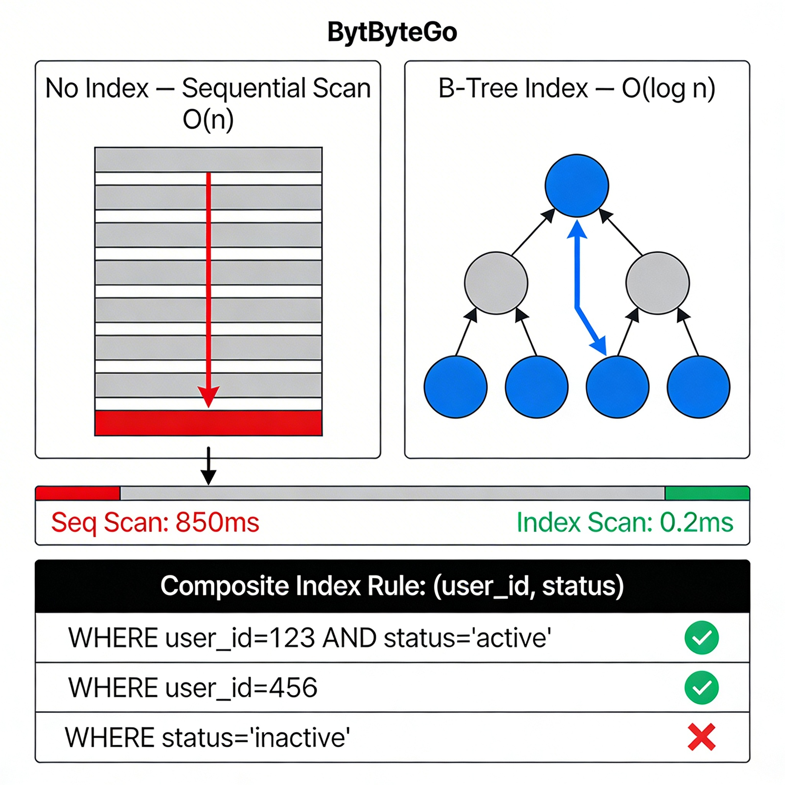

# Indexing

## 1. Overview

An index is a separate data structure that PostgreSQL maintains alongside your table to make lookups fast.

Without an index, finding a row means scanning every single row in the table — top to bottom — until a match is found. With an index, PostgreSQL can jump directly (or near-directly) to the relevant rows.

Think of a book: you could read every page to find "concurrency" — or use the index at the back. Indexes in databases work the same way.

The tradeoff: indexes make reads faster but writes slightly slower, and they consume disk space.

---

## 2. Why This Matters

**Where it is used:**
- Any query with a `WHERE`, `ORDER BY`, or `JOIN` condition on a column benefits from an index.
- Indexes are what make queries on million-row tables return in milliseconds instead of seconds.

**Problems it solves:**
- Without indexes, every query is a full table scan — O(n) time. With the right index, lookups become O(log n) or better.
- Slow queries are often caused by missing indexes. This is one of the most common, easiest-to-fix performance problems.

**Why engineers must understand this:**
- You will write queries that work fine in development (1,000 rows) and break in production (10 million rows).
- Adding an index is not magic — adding the wrong one wastes space and slows writes. You need to understand what you're doing.

---

## 3. Core Concepts (Deep Dive)

### 3.1 How a Full Table Scan Works

**Explanation:**
When there is no index on a column, PostgreSQL performs a Sequential Scan — it reads every row in the table and checks whether it matches your condition.

**Intuition:**
You have a filing cabinet with 1 million unsorted papers. Someone asks for "all papers from Alice." You open the first drawer and read every paper. That's a sequential scan.

**When it happens:**
Any query on a non-indexed column. Also happens when PostgreSQL decides the table is small enough that a scan is faster than using the index.

---

### 3.2 What an Index Is (Structurally)

**Explanation:**
An index is a separate, sorted data structure stored on disk. It maps column values to the physical location (page + row) of matching rows in the table.

**Important:** The index is maintained separately from the table. When you insert, update, or delete a row, PostgreSQL updates the relevant indexes too — this is the write overhead.

---

### 3.3 B-Tree Index (The Default)

**Explanation:**
The default index type in PostgreSQL is a B-Tree (Balanced Tree). It organizes values in a sorted tree structure where every lookup traverses from the root to a leaf node.

**Intuition:**
Think of a binary search on a sorted list — but for on-disk data. The tree has levels. At each level, you eliminate half the remaining candidates. Finding a value in a 1-million-row table takes roughly 20 comparisons (log₂ of 1,000,000).

**Structure:**
```
                  [50]
                /      \
           [25]          [75]
          /    \         /   \
       [10]  [30]     [60]  [90]
```

Each node holds a range of values. Searching for `60` → start at root `50` → go right to `75` → go left to `60`. Done.

**Supports:** `=`, `<`, `>`, `<=`, `>=`, `BETWEEN`, `ORDER BY`, `LIKE 'prefix%'`

**Does NOT support:** `LIKE '%suffix'` (can't binary search by suffix)

---

### 3.4 When PostgreSQL Uses an Index

**Explanation:**
The query planner decides whether to use an index based on:
- Estimated number of matching rows (selectivity)
- Table size
- Index availability

If a query would match 80% of a table, a sequential scan may be faster than an index scan (less random I/O). The planner is generally smart, but you can verify its decision with `EXPLAIN`.

**High selectivity** = few rows match = index is useful
**Low selectivity** = many rows match = sequential scan may be faster

---

### 3.5 Index Types

| Type | Use Case |
|------|----------|
| B-Tree | Default. Range queries, equality, sorting |
| Hash | Equality checks only (`=`). Faster for exact match but no range support |
| GIN | Full-text search, array containment, JSONB |
| GiST | Geometric data, full-text search, nearest-neighbor |
| BRIN | Very large tables with naturally ordered data (e.g., timestamps) |

For 95% of use cases: use the default B-Tree.

---

### 3.6 Composite Indexes

**Explanation:**
An index on multiple columns. `CREATE INDEX ON orders (user_id, status)` is a composite index.

**Key rule — Column Order Matters:**
PostgreSQL can use a composite index if your query filters on the leftmost column(s). It cannot use the index if you skip the first column.

```
Index: (user_id, status)

Can use:    WHERE user_id = 1
Can use:    WHERE user_id = 1 AND status = 'pending'
Cannot use: WHERE status = 'pending'   -- skips user_id
```

**Intuition:**
A phone book sorted by (last name, first name). You can look up "Smith" efficiently. You can look up "Smith, John" efficiently. But you cannot efficiently look up "all Johns" — because Johns are scattered across every last name.

---

### 3.7 Covering Indexes

**Explanation:**
A covering index contains all the columns a query needs. PostgreSQL can answer the query entirely from the index without touching the table at all — called an Index-Only Scan.

```sql
-- Query
SELECT email FROM users WHERE id = 42;

-- If index on (id, email), PostgreSQL reads only the index — never hits the table
```

**When it is used:**
High-frequency queries on performance-critical paths where you want to minimize disk I/O.

---

## 4. Simple Example

```sql
-- No index: full table scan on 10M rows
SELECT * FROM users WHERE email = 'alice@example.com';

-- Create an index
CREATE INDEX idx_users_email ON users (email);

-- Now: index scan — finds the row in milliseconds

-- Composite index for a common query pattern
CREATE INDEX idx_orders_user_status ON orders (user_id, status);

-- This query now uses the composite index efficiently
SELECT * FROM orders WHERE user_id = 42 AND status = 'pending';
```

---

## 5. System Perspective

**In production:**
- Primary keys are automatically indexed by PostgreSQL.
- Foreign key columns are NOT automatically indexed — this is a common oversight. If you JOIN or filter on a foreign key, add an index manually.
- `CREATE INDEX` on a large table in production can lock the table. Use `CREATE INDEX CONCURRENTLY` to build the index without blocking reads/writes.

**Under high traffic:**
- More indexes = slower writes. Every `INSERT`/`UPDATE`/`DELETE` must update all relevant indexes.
- A table with 10 indexes has 10x the write overhead compared to an unindexed table.
- Index bloat occurs when indexes accumulate dead tuples. Regular `VACUUM` maintenance is required.

**Under failure:**
- Corrupt indexes can cause queries to silently return wrong results or error.
- `REINDEX` rebuilds a corrupted index.
- If the query planner makes a wrong choice (uses an index when a scan would be better), you can use `SET enable_indexscan = OFF` to test, but this is a last resort.

---

## 6. Diagram Section



**What the diagram should show:**
- Left side: a table with 8 rows (unsorted), labeled "Full Table Scan" with an arrow scanning all rows
- Right side: a B-Tree diagram with 3 levels, labeled "Index Scan" with an arrow showing traversal to one leaf
- Below both: a time comparison — "Sequential: O(n)", "B-Tree: O(log n)"
- A separate mini diagram showing composite index column order and which queries can/cannot use it

---

## 7. Common Mistakes

**1. Not indexing foreign key columns**
PostgreSQL indexes primary keys automatically, but NOT foreign keys. Queries joining on `user_id` without an index on `orders.user_id` cause full scans.

**2. Over-indexing**
Adding an index on every column "just in case" slows down all writes and wastes space. Add indexes based on actual query patterns.

**3. Ignoring composite index column order**
Creating `(status, user_id)` when your queries filter on `user_id` first means the index won't be used as expected.

**4. Using `LIKE '%term%'`**
A leading wildcard (`%`) disables B-Tree index usage entirely. For full-text search, use `GIN` with `tsvector`.

**5. Running `CREATE INDEX` without `CONCURRENTLY` in production**
Blocks all writes to the table until the index is built. On a large table, this can mean minutes of downtime.

**6. Assuming the planner always uses your index**
The query planner might not use an index if it estimates a sequential scan is faster. Use `EXPLAIN ANALYZE` to verify.

---

## 8. Interview / Thinking Questions

1. You have a `users` table with 50 million rows. A query filtering by `email` takes 30 seconds. What is likely wrong, and what is your first step to fix it?

2. What is the difference between a B-Tree index and a Hash index? When would you choose one over the other?

3. You create a composite index on `(user_id, created_at)`. Which of these queries can use it?
   - `WHERE user_id = 5`
   - `WHERE created_at > '2024-01-01'`
   - `WHERE user_id = 5 AND created_at > '2024-01-01'`

4. What is an Index-Only Scan? How do you design a query to benefit from it?

5. Why does adding too many indexes slow down writes? Walk through what happens during an INSERT on a table with 5 indexes.

---

## 9. Build It Yourself

**Task: Measure index impact with EXPLAIN ANALYZE**

1. Create a `users` table and insert 100,000 rows (use `generate_series` in PostgreSQL)
2. Run `EXPLAIN ANALYZE SELECT * FROM users WHERE email = 'user_50000@test.com'` — note the execution time and plan type (Seq Scan)
3. Create an index on `email`
4. Run the same `EXPLAIN ANALYZE` — compare the execution time and plan type (Index Scan)
5. Create an `orders` table with a foreign key `user_id`, insert 500,000 rows
6. Run a JOIN query without indexing `orders.user_id` — note the time
7. Add an index on `orders.user_id` and re-run — compare

This makes the performance difference real and tangible, not theoretical.

```sql
-- Generate test data
INSERT INTO users (name, email)
SELECT 'User ' || i, 'user_' || i || '@test.com'
FROM generate_series(1, 100000) AS i;
```

---

## 10. Use AI vs Think Yourself

### Use AI For:
- Generating the correct `CREATE INDEX` syntax for a specific type
- Helping interpret `EXPLAIN ANALYZE` output
- Suggesting which columns to consider indexing based on a query

### Must Understand Yourself:
- Whether an index is actually needed — based on table size, query frequency, and selectivity
- The column order in composite indexes — AI will often get this wrong without full context
- The write overhead tradeoff — adding indexes is not free
- Reading `EXPLAIN ANALYZE` output to understand what the planner is doing

---

## 11. Key Takeaways

- Without indexes, every query scans every row. This is fine at small scale, catastrophic at large scale.
- B-Tree is the default and handles most cases: equality, range, and sort queries.
- Column order in composite indexes is not arbitrary — queries must match the leftmost prefix.
- PostgreSQL automatically indexes primary keys but NOT foreign keys. Add those manually.
- Use `EXPLAIN ANALYZE` to verify the planner is doing what you expect.
- Indexes speed up reads at the cost of slower writes and more disk space. Add them intentionally.
