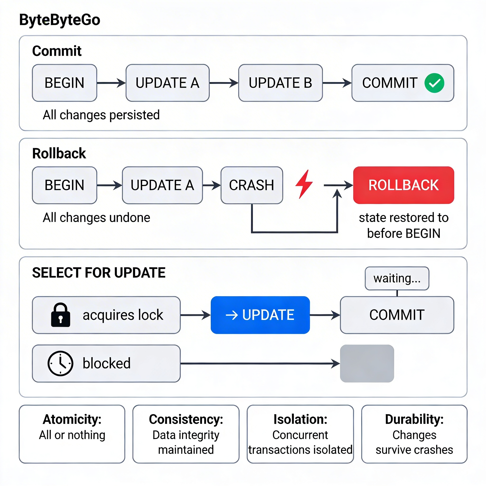

# Transactions & Data Integrity

## 1. Overview

A transaction is a group of database operations treated as a single unit. Either all operations succeed together, or none of them do.

This sounds simple, but it is one of the most important guarantees a database provides. Without transactions, a system crash or concurrent request in the middle of a multi-step operation can leave your data in a broken, inconsistent state.

Transactions are the mechanism that keeps your data honest.

---

## 2. Why This Matters

**Where it is used:**
- Any operation that touches more than one row or table needs a transaction.
- Bank transfers, order placement, inventory updates, payment processing — all require transactions.

**Problems it solves:**
- Without transactions: a bank transfer that debits account A but crashes before crediting account B loses money permanently.
- With transactions: both the debit and credit succeed or both are rolled back. No in-between state is possible.

**Why engineers must understand this:**
- Bugs caused by missing transactions are among the hardest to reproduce and debug — they only appear under concurrent load or at the exact moment of a crash.
- Not understanding isolation levels leads to race conditions and incorrect reads that seem random.
- These concepts appear in every serious backend interview.

---

## 3. Core Concepts (Deep Dive)

### 3.1 ACID Properties

ACID is the set of guarantees that define what a reliable transaction looks like.

---

**Atomicity**

Either all operations in the transaction succeed, or none of them are applied.

*Intuition:* A transaction is like a light switch — it is either fully ON or fully OFF. There is no "halfway on." If your transfer fails mid-way, the database rolls back to where it started.

---

**Consistency**

A transaction takes the database from one valid state to another valid state. It cannot violate any defined rules (constraints, foreign keys, unique keys).

*Intuition:* If you have a rule that `balance >= 0`, a transaction that would make balance negative is rejected. Consistency means your rules are always enforced.

---

**Isolation**

Concurrent transactions don't interfere with each other. Each transaction runs as if it were the only one operating on the database at that moment.

*Intuition:* Two people booking the last seat on a flight at the same time — isolation ensures they don't both get a confirmation for the same seat.

This is the most complex and nuanced of the ACID properties. It is controlled by **isolation levels**.

---

**Durability**

Once a transaction commits, its changes are permanent — even if the server crashes immediately after.

*Intuition:* When your bank confirms a deposit, that money doesn't disappear if there's a power outage. It's written to disk (via WAL — Write-Ahead Log) before the confirmation is sent.

---

### 3.2 BEGIN / COMMIT / ROLLBACK

**Explanation:**
These are the SQL commands that control transaction boundaries.

```sql
BEGIN;         -- Start the transaction
-- operations --
COMMIT;        -- Finalize and persist all changes
ROLLBACK;      -- Undo all changes since BEGIN
```

**Intuition:**
`BEGIN` is picking up a pen to draft changes. `COMMIT` is signing the document. `ROLLBACK` is throwing the draft in the bin.

**Auto-commit:**
By default, PostgreSQL wraps every single statement in its own transaction (auto-commit mode). `BEGIN` lets you group multiple statements into one transaction manually.

---

### 3.3 Isolation Levels

**Explanation:**
Isolation levels control how much a transaction is isolated from other concurrent transactions. Higher isolation = more protection, but more contention and lower throughput.

PostgreSQL supports four isolation levels:

| Level | Protection |
|-------|------------|
| Read Uncommitted | Not really supported in PG (treated as Read Committed) |
| Read Committed | Default. Each query sees only committed data |
| Repeatable Read | All queries in the transaction see a consistent snapshot from the start |
| Serializable | Full isolation — transactions appear to run sequentially |

---

**Read Committed (Default)**

Each statement inside a transaction sees the latest committed data at the time that statement runs.

*Problem it allows:* Non-repeatable reads — if you read a value twice in the same transaction, you might see different values if another transaction committed between your two reads.

---

**Repeatable Read**

The entire transaction sees data as it existed when the transaction started. Other commits mid-transaction are invisible to you.

*Problem it allows:* Phantom reads (in theory — PostgreSQL's implementation actually prevents these too).

---

**Serializable**

The strongest guarantee. Transactions behave exactly as if they were run one at a time, sequentially. Any concurrency anomaly is prevented.

*Cost:* Higher overhead, more transaction failures that need retrying. Used for financial systems where correctness is non-negotiable.

---

### 3.4 Isolation Anomalies (What Goes Wrong Without Proper Isolation)

**Dirty Read:** Reading uncommitted changes from another transaction. (PostgreSQL never allows this.)

**Non-Repeatable Read:** Reading the same row twice and getting different values because another transaction committed between your reads.

**Phantom Read:** Running the same query twice and getting different rows because another transaction inserted new rows between your reads.

**Lost Update:** Two transactions read a value, both modify it, both write — the first write is overwritten and lost.

*Intuition for Lost Update:*
```
Transaction A reads balance = 100
Transaction B reads balance = 100
Transaction A writes balance = 90  (deducted 10)
Transaction B writes balance = 80  (deducted 20, based on stale 100)
Result: Balance is 80, but should be 70. $10 was lost.
```

---

### 3.5 Locks (High Level)

**Explanation:**
When multiple transactions try to access the same data simultaneously, PostgreSQL uses locks to coordinate access.

**Row-Level Locks:**
- `SELECT FOR UPDATE` — acquires an exclusive lock on selected rows. Other transactions must wait.
- `SELECT FOR SHARE` — multiple readers can hold this simultaneously, but writers must wait.

**Table-Level Locks:**
Operations like `ALTER TABLE` acquire a table-level lock that blocks all reads and writes until complete.

**Deadlock:**
Transaction A holds lock on row 1 and waits for row 2. Transaction B holds lock on row 2 and waits for row 1. Neither can proceed. PostgreSQL detects this and aborts one of the transactions.

*Intuition:* Two people reaching for the same two items at the same time, each grabbing one and waiting for the other. Neither can move until one gives up.

---

## 4. Simple Example

```sql
-- Bank transfer: move $100 from account A to account B
BEGIN;

UPDATE accounts SET balance = balance - 100 WHERE id = 1;
UPDATE accounts SET balance = balance + 100 WHERE id = 2;

-- Check for invalid state before committing
-- (In real code, application logic verifies this)

COMMIT;

-- If anything fails, the application calls:
ROLLBACK;
-- Both updates are undone. Neither account is changed.
```

**Using SELECT FOR UPDATE to prevent lost updates:**
```sql
BEGIN;

SELECT balance FROM accounts WHERE id = 1 FOR UPDATE;
-- Other transactions trying to update this row must wait

UPDATE accounts SET balance = balance - 100 WHERE id = 1;

COMMIT;
```

---

## 5. System Perspective

**In production:**
- Most ORMs wrap each operation in a transaction automatically. But multi-step business operations (e.g., create order + deduct inventory + charge payment) need explicit transactions wrapping all steps.
- Long-running transactions hold locks and block other operations. Keep transactions short.

**Under high traffic:**
- Lock contention is a major source of performance degradation. Transactions waiting on locks pile up, causing latency spikes.
- Serializable isolation under high concurrency causes many transaction retries — you must design your application to retry serialization failures.
- Optimistic concurrency control (check-and-update patterns) can avoid locks at the cost of retry logic.

**Under failure:**
- PostgreSQL's WAL ensures durability. Even if the server crashes after `COMMIT` but before flushing to disk, the WAL allows recovery.
- Uncommitted transactions are automatically rolled back on restart.
- Application-level retries on deadlock errors are required — PostgreSQL will abort one transaction in a deadlock, and your application must re-try the operation.

---

## 6. Diagram Section



**What the diagram should show:**
- Left side: A timeline of a successful transaction — BEGIN → multiple operations → COMMIT — with a green checkmark showing all changes persisted
- Center: A failed transaction — BEGIN → operations → CRASH → ROLLBACK — with a red arrow showing all changes undone
- Right side: Two concurrent transactions on the same row — one with `SELECT FOR UPDATE` causing the second to wait, then proceed after the first commits
- A small ACID table as a visual reference

---

## 7. Common Mistakes

**1. Not wrapping multi-step operations in a transaction**
Creating an order and deducting inventory in two separate statements means a crash between them leaves inventory deducted but no order created. Always use transactions for multi-step operations.

**2. Keeping transactions open too long**
Long transactions hold locks. In a web application, if a transaction spans an HTTP request waiting for user input, it can hold locks for seconds or minutes, blocking other users.

**3. Assuming default isolation level prevents all anomalies**
Read Committed (the default) still allows non-repeatable reads. If your logic reads data twice and assumes it's the same, use Repeatable Read or Serializable.

**4. Not handling deadlocks**
Deadlocks will happen in concurrent systems. If your application doesn't catch and retry on deadlock errors, those transactions just fail silently.

**5. Using transactions as a performance optimization for bulk inserts without understanding the tradeoff**
Wrapping 10,000 inserts in one transaction is faster (reduces WAL flushing overhead), but if it fails, you lose all 10,000. Batch size is a correctness vs. performance tradeoff.

---

## 8. Interview / Thinking Questions

1. Explain ACID. Which property is the hardest to achieve in a distributed system, and why?

2. Two concurrent transactions both read a user's balance and deduct from it. What anomaly can occur, and how do you prevent it?

3. What is the difference between Read Committed and Repeatable Read? Give a scenario where the distinction matters.

4. What is a deadlock? How does PostgreSQL handle it, and how should your application handle it?

5. When would you choose Serializable isolation over Read Committed? What is the cost?

---

## 9. Build It Yourself

**Task: Demonstrate the lost update problem and fix it**

1. Create an `accounts` table with `id` and `balance`
2. Insert one row with `balance = 1000`
3. Open two `psql` sessions simultaneously
4. In both sessions, run `SELECT balance FROM accounts WHERE id = 1` — both see 1000
5. In Session 1: `UPDATE accounts SET balance = 900 WHERE id = 1; COMMIT;`
6. In Session 2 (without refreshing): `UPDATE accounts SET balance = 800 WHERE id = 1; COMMIT;`
7. Check the result — you've lost the Session 1 deduction

**Now fix it:**
1. Repeat, but this time use `SELECT balance FROM accounts WHERE id = 1 FOR UPDATE` in both sessions
2. Observe that Session 2 blocks until Session 1 commits
3. Session 2 then sees the updated value (900) before computing its update

This exercise makes the abstract concept of lost updates visceral and real.

---

## 10. Use AI vs Think Yourself

### Use AI For:
- Remembering exact SQL syntax for isolation level settings
- Explaining what a specific PostgreSQL error (e.g., `40001 serialization_failure`) means
- Generating test data to simulate concurrent transactions

### Must Understand Yourself:
- When a multi-step operation needs a transaction — this is a design decision
- Which isolation level your system requires — depends on your business logic
- How to prevent lost updates — a common concurrency bug with serious consequences
- What happens in your system when a transaction fails or deadlocks — failure design is your responsibility

---

## 11. Key Takeaways

- A transaction is an all-or-nothing unit. Either everything succeeds, or nothing changes.
- ACID guarantees are what separate a reliable database from an unreliable one. Know them deeply.
- Isolation levels are a spectrum: more isolation = safer reads, but less concurrency.
- Read Committed (PostgreSQL's default) is not fully safe for all patterns — know its limits.
- Keep transactions short. Long transactions hold locks and block the entire system.
- Deadlocks are normal — design your application to detect and retry them.
