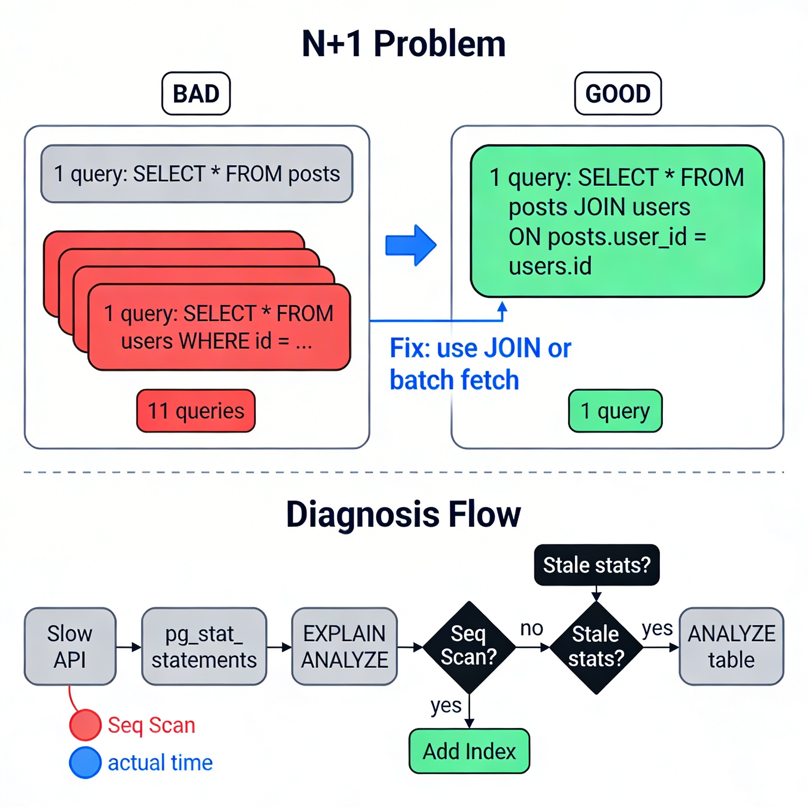

# Database Performance

## 1. Overview

Database performance is about understanding why queries are slow and having a systematic way to fix them.

Most slow APIs are slow because of the database — not the application logic. A query that scans a million rows, a missing index, or a cascade of unnecessary queries can turn a 10ms API into a 5-second one.

This chapter is about developing the instinct to identify, diagnose, and fix database performance problems before they become production incidents.

---

## 2. Why This Matters

**Where it is used:**
- Every backend application that uses a database will eventually face slow queries.
- Performance problems rarely appear in development — they appear at scale, under load, in production.

**Problems it solves:**
- Slow queries cause slow APIs, degraded user experience, and server strain.
- Unoptimized queries can saturate a database server even with modest traffic.

**Why engineers must understand this:**
- Performance bugs are invisible in development. You need tools to see them.
- A 10x traffic increase doesn't require 10x hardware if your queries are efficient.
- This is a core competency in backend engineering — not an advanced topic.

---

## 3. Core Concepts (Deep Dive)

### 3.1 How to Read EXPLAIN ANALYZE

**Explanation:**
`EXPLAIN ANALYZE` shows the query execution plan and actual runtime statistics. It is the most important diagnostic tool for database performance.

**Syntax:**
```sql
EXPLAIN ANALYZE SELECT * FROM orders WHERE user_id = 42;
```

**Key fields to understand:**

| Field | Meaning |
|-------|---------|
| `Seq Scan` | Full table scan — reads every row |
| `Index Scan` | Uses an index to find rows |
| `Index Only Scan` | Reads from index only — never touches the table |
| `Nested Loop` | Join strategy: for each row in outer table, probe inner |
| `Hash Join` | Builds a hash table of one side, probes it with the other |
| `cost=X..Y` | Estimated cost (startup..total). Not wall clock time |
| `actual time=X..Y` | Actual execution time in milliseconds |
| `rows=N` | Actual number of rows processed at this step |
| `loops=N` | How many times this node was executed |

**Intuition:**
The plan is a tree. The innermost nodes run first. Read it bottom-up. Look for nodes with high actual time or `rows` values that are much larger than expected — those are your bottlenecks.

**Red flags:**
- `Seq Scan` on a large table with a low row estimate — missing index
- `rows=1000000` at an intermediate step — too much data being processed
- Estimated rows very different from actual rows — stale table statistics, run `ANALYZE`

---

### 3.2 Slow Query Identification

**Explanation:**
Before you can fix slow queries, you need to find them. PostgreSQL has built-in tools for this.

**pg_stat_statements:**
An extension that tracks query execution statistics across all queries — total calls, total time, average time, rows processed.

```sql
-- Enable once
CREATE EXTENSION pg_stat_statements;

-- Find the slowest queries by total time
SELECT query, calls, total_exec_time, mean_exec_time
FROM pg_stat_statements
ORDER BY total_exec_time DESC
LIMIT 10;
```

**log_min_duration_statement:**
In `postgresql.conf`, set this to log any query that takes longer than a threshold:
```
log_min_duration_statement = 1000  -- log queries over 1 second
```

**Intuition:**
Don't guess which queries are slow. Measure. The query you think is slow is rarely the actual bottleneck.

---

### 3.3 Query Optimization Patterns

**Explanation:**
Once you know which query is slow, there are common patterns to fix it.

**Pattern 1: Add a missing index**
The most common fix. If `EXPLAIN` shows a `Seq Scan` on a large table, check if the filtered column has an index.

**Pattern 2: Rewrite the WHERE clause for index usage**
Functions on indexed columns disable index usage:
```sql
-- Bad: function on indexed column, disables index
WHERE LOWER(email) = 'alice@example.com'

-- Good: normalize at insert time, query the normalized value
WHERE email = 'alice@example.com'
```

**Pattern 3: Avoid SELECT ***
Fetching all columns when you need 2 forces the DB to read more data and transfer more bytes over the network.

**Pattern 4: Use LIMIT aggressively**
Never return unbounded result sets. Always `LIMIT` in production queries.

**Pattern 5: Push filters as early as possible**
Filter data close to the source. Don't fetch 100,000 rows and filter in application code.

---

### 3.4 The N+1 Problem

**Explanation:**
The N+1 problem occurs when you fetch a list of N items and then execute one additional query per item to fetch related data — resulting in N+1 total queries.

**Classic example:**
```
Query 1: SELECT * FROM posts LIMIT 10           -- returns 10 posts
Query 2: SELECT * FROM users WHERE id = ?        -- for post 1
Query 3: SELECT * FROM users WHERE id = ?        -- for post 2
...
Query 11: SELECT * FROM users WHERE id = ?       -- for post 10
```

10 posts = 11 queries. With 100 posts = 101 queries. At scale this is catastrophic.

**Intuition:**
It's like going to a grocery store, buying one item, going home, then going back for the next item 99 more times. A single trip that picks up everything is always faster.

**The Fix — JOIN or batch loading:**
```sql
-- One query that fetches posts and their authors together
SELECT posts.*, users.name AS author_name
FROM posts
JOIN users ON posts.user_id = users.id
LIMIT 10;
```

Or use `WHERE IN` to batch the user lookups:
```sql
-- Get all user IDs from posts first, then fetch in one query
SELECT * FROM users WHERE id IN (1, 2, 3, 4, 5, 6, 7, 8, 9, 10);
```

**How it appears with ORMs:**
ORMs that lazy-load relationships generate N+1 queries silently. Enable query logging to catch this. In Prisma, use `include`. In SQLAlchemy, use `joinedload`.

---

### 3.5 Stale Statistics and ANALYZE

**Explanation:**
PostgreSQL's query planner uses statistics about your data (row counts, value distributions) to choose the best execution plan. These statistics can become stale if the data changes significantly.

**ANALYZE** updates the statistics. **VACUUM** removes dead tuples (rows left behind by updates/deletes). **AUTOVACUUM** does this automatically, but in high-write scenarios it can fall behind.

**Symptom of stale statistics:**
`EXPLAIN` shows `rows=100` but `EXPLAIN ANALYZE` shows `actual rows=50000`. The planner makes a bad plan based on wrong estimates.

**Fix:**
```sql
ANALYZE orders;  -- update statistics for the orders table
```

---

## 4. Simple Example

```sql
-- Slow query
EXPLAIN ANALYZE
SELECT * FROM orders WHERE user_id = 42 AND status = 'pending';

-- Output shows: Seq Scan on orders (cost=...) actual time=850ms rows=3
-- Problem: Full scan to find 3 rows

-- Fix: Add a composite index
CREATE INDEX idx_orders_user_status ON orders (user_id, status);

-- Re-run EXPLAIN ANALYZE
-- Output now shows: Index Scan using idx_orders_user_status
-- actual time=0.2ms rows=3
-- ~4000x improvement
```

---

## 5. System Perspective

**In production:**
- Most backends have a handful of "hot queries" that run thousands of times per minute. Optimizing those 5 queries has more impact than optimizing 50 rarely-run queries.
- Connection pooling (PgBouncer) is critical — each PostgreSQL connection is a process. 1,000 concurrent connections without pooling will crash a database server.
- Read replicas offload read traffic — direct expensive reporting queries to the replica, not the primary.

**Under high traffic:**
- A slow query under light load becomes catastrophic under heavy load. 200ms × 1,000 concurrent requests = the database is saturated.
- Missing indexes cause table scans that lock shared I/O resources, making all queries slower simultaneously.
- Autovacuum can't keep up with extremely high write rates, leading to table bloat and degraded performance.

**Under failure:**
- Long-running slow queries can hold locks and block all writes to a table.
- `pg_stat_activity` shows all currently running queries — use it to identify and kill stuck queries in emergencies.
- A bad query deployed to production can be terminated with: `SELECT pg_terminate_backend(pid)`.

---

## 6. Diagram Section



**What the diagram should show:**
- A flowchart: Slow API → Check slow query log → EXPLAIN ANALYZE → Identify bottleneck (Seq Scan / high actual time) → Apply fix (Add index / Rewrite query / Fix N+1) → Re-measure
- A side panel showing N+1 visually: 1 initial query producing N results → N follow-up queries (with a red X) vs. 1 JOIN query (with a green checkmark)
- A small EXPLAIN output snippet with annotations pointing to "Seq Scan", "actual time", "rows"

---

## 7. Common Mistakes

**1. Guessing which query is slow without measuring**
Intuition is wrong. Use `pg_stat_statements` or query logs to find the actual bottleneck.

**2. Not enabling query logging in development**
N+1 problems and slow queries are invisible unless you can see the SQL being sent to the database. Always log queries during development.

**3. Ignoring EXPLAIN — just running queries**
If you can't read an EXPLAIN output, you can't diagnose performance problems. This is a required skill.

**4. Fixing the wrong layer**
Adding caching before fixing a fundamentally broken query. Cache the right thing, but fix the query first.

**5. SELECT * in production**
Fetches columns you don't need, uses more memory, slows down the planner.

**6. Not accounting for N+1 when using ORMs**
ORMs make data access convenient but can silently generate disastrous query patterns. Always verify what SQL is being generated.

---

## 8. Interview / Thinking Questions

1. You get a report that your API endpoint is slow. Walk me through your process for diagnosing the problem — starting from the API response time, down to the database.

2. What is the N+1 problem? Show a code pattern that causes it and a pattern that fixes it.

3. You run `EXPLAIN ANALYZE` and see that the planner estimated 100 rows but the query actually returned 500,000 rows. What does this tell you, and what do you do?

4. What is connection pooling and why is it necessary in a high-traffic backend?

5. How do you find the slowest queries in a PostgreSQL database that you've never worked on before?

---

## 9. Build It Yourself

**Task: Find and fix an N+1 query in your schema**

1. Create a `posts` table with `user_id` foreign key, insert 50 posts across 10 users
2. Write a Node.js / Python script that fetches all posts and then for each post fetches the user — measure the number of queries and total time
3. Rewrite it to use a JOIN or batch fetch — measure again
4. Use `EXPLAIN ANALYZE` to compare the two approaches at the database level
5. Use `pg_stat_statements` to see the query count difference

Bonus: enable `log_min_duration_statement = 0` temporarily and watch all queries appear in the PostgreSQL log.

---

## 10. Use AI vs Think Yourself

### Use AI For:
- Help interpreting a specific `EXPLAIN ANALYZE` output
- Generating test data to reproduce performance issues
- Syntax for `pg_stat_statements` queries
- Understanding specific PostgreSQL configuration parameters

### Must Understand Yourself:
- How to read an execution plan — this is a core diagnostic skill
- Whether an N+1 pattern exists in your code — AI won't see it unless you show it the full context
- Whether caching is the right fix or the underlying query needs optimization
- What "index selectivity" means and whether your index will actually be used

---

## 11. Key Takeaways

- Database performance is measurable. Use tools: `EXPLAIN ANALYZE`, `pg_stat_statements`, query logs.
- The N+1 problem is the most common application-level performance bug. Catch it with query logging.
- Slow queries in development become catastrophic queries in production. Test with realistic data volumes.
- EXPLAIN ANALYZE is non-negotiable. If you can't read a query plan, you cannot diagnose performance.
- Optimize the hot path — the 5 queries that run most frequently matter more than the 50 that run rarely.
- Caching is not a substitute for a well-optimized query. Fix the query first.
