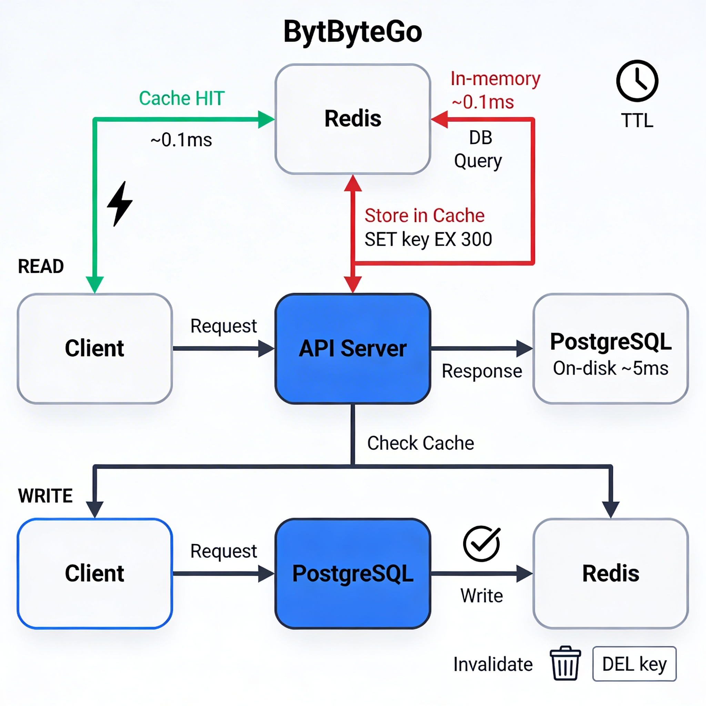

# Redis (Caching)

## 1. Overview

Redis is an in-memory data store — it holds data in RAM rather than on disk. This makes it orders of magnitude faster than a traditional database for reads.

Caching means storing the result of an expensive operation so that future requests can get that result instantly without repeating the work.

The core idea: if computing or fetching something is expensive, compute it once, store the result in Redis, and serve every subsequent request from there — until the data needs to change.

---

## 2. Why This Matters

**Where it is used:**
- Caching database query results to reduce database load
- Storing session data for authentication
- Rate limiting API endpoints
- Leaderboards, counters, pub/sub messaging
- Used at scale by Twitter, GitHub, Stack Overflow, and nearly every high-traffic backend

**Problems it solves:**
- Without caching: every request hits the database. At high traffic, the database becomes the bottleneck.
- With caching: 95% of requests are served from RAM, the database only handles the remaining 5%.

**Why engineers must understand this:**
- Caching is one of the most impactful performance tools available. It can make a slow system fast instantly.
- But incorrect caching causes bugs that serve stale or wrong data — sometimes worse than being slow.
- You must understand not just how to add a cache, but when, what to cache, and when to invalidate it.

---

## 3. Core Concepts (Deep Dive)

### 3.1 Key-Value Storage

**Explanation:**
Redis stores data as key-value pairs. A key is a string. A value can be a string, number, list, hash, set, sorted set, or more complex types.

**Intuition:**
Think of it as a dictionary or hashmap — but one that lives on a server, persists across process restarts (optionally), and can be shared across multiple application instances.

```
Key: "user:42:profile"
Value: '{"name":"Alice","email":"alice@example.com"}'
```

**When it is used:**
Any time you want to store something with a name and retrieve it by that name — fast.

**Key design matters:**
Use structured, namespaced keys to avoid collisions:
`user:{id}:profile`, `session:{token}`, `rate_limit:{ip}:{endpoint}`

---

### 3.2 TTL (Time To Live / Expiration)

**Explanation:**
Every key in Redis can have a TTL — a time in seconds after which the key is automatically deleted. Once the TTL expires, the key no longer exists.

**Intuition:**
Think of a sticky note on a whiteboard with an expiry date. After that date, it's automatically removed. You don't have to clean up manually.

**Why TTL matters:**
- Cache entries go stale. User profiles change, prices change, inventory changes.
- Without TTL, your cache fills up with old data forever (memory exhaustion).
- TTL is your safety net: even if you forget to invalidate a cache entry explicitly, it will eventually expire and be refreshed.

```
SET user:42:profile "..." EX 300   -- expires in 300 seconds (5 minutes)
```

**Choosing TTL:**
- Frequently changing data: short TTL (30–60 seconds)
- Slowly changing data: longer TTL (5–60 minutes)
- Rarely changing data: hours or more

---

### 3.3 Cache Patterns

**Read-Through Cache:**

The application always checks the cache first. On a cache miss, it fetches from the database, stores the result in Redis, then returns it. Subsequent requests hit the cache.

```
Request → Check Redis
  Cache HIT  → Return cached value
  Cache MISS → Query database → Store in Redis → Return value
```

**Intuition:**
Like a library reservation desk. If a book is available at the desk (cache), take it immediately. If not, go to the stacks (database), bring it back, leave a copy at the desk for the next person.

**Write-Through Cache:**
On every write, update both the database and the cache simultaneously. Ensures the cache is never stale.

*Cost:* Every write is now two operations. Adds latency to writes.

**Write-Around Cache:**
Only write to the database. Don't update the cache. Let the cache expire and be refreshed on the next read.

*Use when:* Data is written frequently but read infrequently — no point caching it.

**Cache-Aside (Lazy Loading — Most Common):**
Application code controls the cache explicitly. On write, invalidate the cache key. On read, populate if missing.

*This is what most backends do in practice.*

---

### 3.4 Cache Invalidation

**Explanation:**
Cache invalidation is the process of removing or updating a cached value when the underlying data changes.

**Intuition:**
You cached a user's profile. The user just updated their name. The cache now has wrong data. Invalidation is the act of either deleting the cached entry or overwriting it with the new value.

**Strategies:**

| Strategy | Description |
|----------|-------------|
| Delete on write | When data changes, delete the cache key. Next read will re-populate. |
| Update on write | When data changes, update the cache key with the new value. |
| TTL expiry | Let stale data expire naturally. Acceptable when brief staleness is OK. |
| Event-driven | Use pub/sub or message queues to notify cache invalidation across services. |

**The hardest problem in engineering:**
Cache invalidation is famously difficult. The challenge: knowing exactly which cache keys are affected by a given write. Bugs here lead to users seeing stale data — sometimes indefinitely if the TTL is long.

---

## 4. Simple Example

```
// Cache-aside pattern (pseudo-code)

async function getUserProfile(userId) {
  const cacheKey = `user:${userId}:profile`;

  // 1. Check cache
  const cached = await redis.get(cacheKey);
  if (cached) {
    return JSON.parse(cached);  // Cache HIT
  }

  // 2. Cache MISS — fetch from database
  const user = await db.query('SELECT * FROM users WHERE id = $1', [userId]);

  // 3. Store in cache with 5-minute TTL
  await redis.set(cacheKey, JSON.stringify(user), 'EX', 300);

  return user;
}

async function updateUserProfile(userId, data) {
  await db.query('UPDATE users SET ... WHERE id = $1', [userId]);

  // Invalidate the cache
  await redis.del(`user:${userId}:profile`);
}
```

---

## 5. System Perspective

**In production:**
- Redis is typically deployed as a separate service (or cluster), not on the same machine as your application.
- Redis is single-threaded for command execution — it processes one command at a time. This is fine because operations are extremely fast (microseconds).
- Redis Cluster shards data across multiple nodes for horizontal scaling.

**Under high traffic:**
- A well-placed cache can reduce database queries by 80–95%, allowing the database to handle far more total traffic.
- If Redis goes down, all requests fall through to the database — this is called a "cache stampede" — thousands of simultaneous cache misses hitting the database at once. This can take down the DB.
- Mitigation for stampede: request coalescing (only one request populates the cache per key), probabilistic early expiration, or circuit breakers.

**Under failure:**
- Redis persistence options: RDB (snapshots) and AOF (append-only log). Without persistence, Redis data is lost on restart.
- For session storage or other critical data, enable AOF persistence or use a replicated Redis setup.
- Design your system to degrade gracefully when Redis is unavailable — fall back to the database, not to an error.

---

## 6. Diagram Section



**What the diagram should show:**
- A horizontal flow: Client → Application → Redis (cache check)
- Two branches from Redis: "HIT" path (returns directly) vs "MISS" path (goes to PostgreSQL → stores in Redis → returns)
- A clock icon next to the Redis box labeled "TTL"
- An "UPDATE" flow showing: Write to DB → Invalidate Redis key
- Label the components: "In-memory (RAM)", "On-disk (PostgreSQL)", "~0.1ms vs ~5ms"

---

## 7. Common Mistakes

**1. Caching everything without thinking about invalidation**
Adding a cache is easy. Knowing when to invalidate it is hard. Before caching something, ask: "When this data changes, how will I know to clear the cache?"

**2. Not setting a TTL**
Without TTL, stale entries live forever. Memory fills up. Old data gets served. Always set a TTL.

**3. Caching at the wrong granularity**
Caching an entire page that contains user-specific data means every user gets the same cached page. Cache at the right level of granularity.

**4. Using Redis as a primary database**
Redis is a cache (and sometimes a queue). It is not a durable primary store for critical data unless explicitly configured with strong persistence. Treat it as ephemeral.

**5. Not handling cache misses under load**
If the cache is cold (empty) and 1,000 requests arrive simultaneously, all 1,000 go to the database. Design for this.

**6. Storing too-large values**
Redis is RAM-limited. Storing large serialized objects wastes memory and increases serialization overhead. Cache only what is needed.

---

## 8. Interview / Thinking Questions

1. Explain the cache-aside pattern. When would you choose it over write-through caching?

2. What is a cache stampede? How does it happen, and what are the mitigation strategies?

3. You cache a user's profile for 10 minutes. The user updates their email mid-cache. What are your options, and what are the tradeoffs of each?

4. How do you choose a TTL for a cached value? What factors influence that decision?

5. Your Redis instance goes down. What happens to your application? How do you design for this?

---

## 9. Build It Yourself

**Task: Implement a cache-aside layer for your user profile endpoint**

1. Set up a local Redis instance (Docker: `docker run -p 6379:6379 redis`)
2. Build an API endpoint: `GET /users/:id`
3. Without caching: query PostgreSQL for the user profile
4. Add cache-aside logic:
   - Check Redis first with key `user:{id}:profile`
   - On miss: query DB, store in Redis with 5 minute TTL
   - Return the result
5. Build `PUT /users/:id` to update the profile and delete the cache key
6. Test: call GET twice — first call hits the DB (add a log), second call serves from cache
7. Update the user — call GET again — verify it re-fetches from DB

Measure response time difference between cache hit and cache miss.

---

## 10. Use AI vs Think Yourself

### Use AI For:
- Redis command syntax (SET, GET, DEL, EXPIRE, TTL)
- Boilerplate for connecting to Redis in your language
- Generating cache key naming schemes
- Explaining Redis data structure commands (HSET, LPUSH, ZADD)

### Must Understand Yourself:
- What to cache and what NOT to cache — depends on your data's change frequency
- How to handle cache invalidation for your specific data model
- How your system behaves when Redis is unavailable
- The right TTL for each type of cached data — this is a business and system decision

---

## 11. Key Takeaways

- Redis stores data in RAM — reads are ~100x faster than PostgreSQL for the same data.
- Always set a TTL. It protects against memory exhaustion and stale data.
- Cache-aside is the most common pattern: check cache, fall back to DB on miss, populate cache.
- Cache invalidation is the hard part. Before caching, design the invalidation strategy first.
- Redis is a cache (and a utility store), not a primary database. Treat it as ephemeral.
- Design for Redis failure. Your system should degrade gracefully, not break completely.
